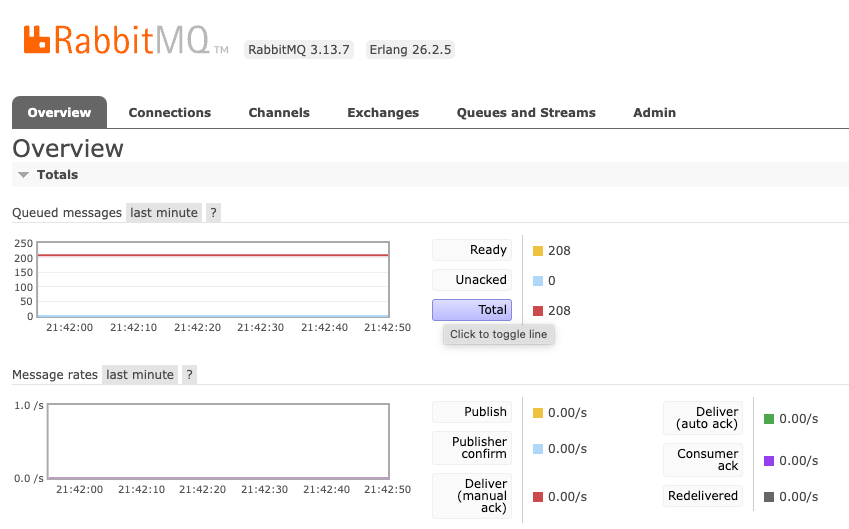

# Pizza POS

### Stack:
- PHP (Laravel)
- JavScript (Vue.js)
- CSS (Tailwind)
- MySQL

### Requirements:
- Docker
- Composer
- PHP
- MySQL

### Setup Commands:
- `composer install` : install composer packages
- `cp .env.example .env` : create env file
- `npm install` : install node packages
- `./vendor/bin/sail up` : start running docker container
- `./vendor/bin/sail artisan migrate:fresh --seed` : refresh and seed database

- `cd Modules/Order`: change directory to order modules

module directory:
- `npm run build`
- `npm run dev`

### Other Commands
- `./vendor/bin/sail down` : stop running docker containers
- `./vendor/bin/sail artisan test` : run tests
- `./vendor/bin/sail artisan test -filter "test_single"` : run single test
- `./vendor/bin/pint` : clean up back-end code
- `npx prettier . --write`: clean up front-end code

### Cypress Commands (module directory)
- `npx cypress run` : run front-end tests
- `npx cypress open` : open cypress

###  Module Commands
- `./vendor/bin/sail  artisan module:migrate Order` : migrate order module database
- `./vendor/bin/sail artisan module:seed Order` : seed order module seeders
- `./vendor/bin/sail artisan module:migrate-fresh Order --seed`: refresh and seed order module database

The [Laravel Modules package](https://github.com/nWidart/laravel-modules) was used to create this module, [more module commands](https://laravelmodules.com/docs/v11/artisan-commands#module-migrate).

###  Jobs (RabbitMQ)

When an order status gets updated, the `OrderStatusUpdated` gets fired which notifies other applications via RabbitMQ.

To test this:
- Visit [CloudAMPQ](https://customer.cloudamqp.com/login)
- Create an instance and update your RabbitMQ credentials in the `.env`
- Whenever an order gets updated, you should see it on your queued messages ready to be processed, example in screenshot.

NB: My initial approach was to send a HTTP request to the website's API via `app(MainAppInterface::class)->updateOrder(..))`.
HTTP communication is ideal in some situations but it can at times create dependencies. By using an Event-driven architecture (EDA),
we can keep the services loosely coupled and jobs could be retried if they happen to fail.
